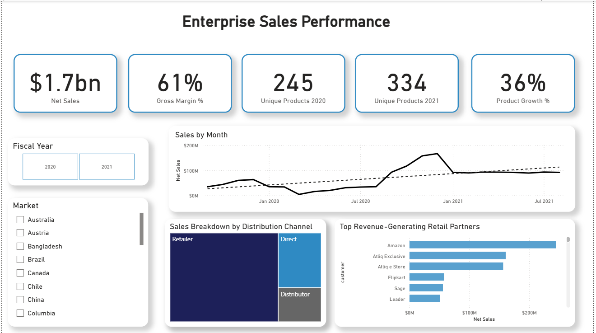
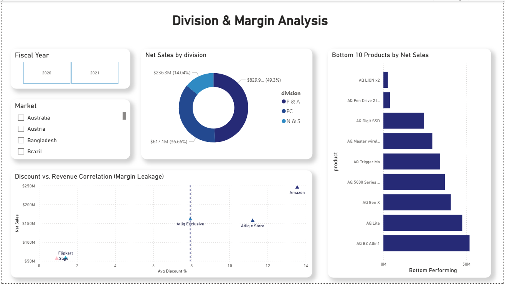

# AtLiQ Consumer Goods: Sales & Ad-Hoc Analytics

## 🚀 Business Impact
* **Scale:** Analyzed **$1.7B in Net Sales**, **334 products**, and **245 unique customers** globally.
* **Profit Recovery:** Executed a specialized **Margin Leakage Analysis** to isolate high-discount distribution channels (e.g., Amazon) eating into net margins.
* **Performance:** Delivered a production-grade 2-page Executive Sales Dashboard built on an optimized Star Schema.

---

## 🛠️ Tech Stack & Architecture
* **Database Engine:** MySQL (Complex Joins, Window Functions, Custom Ad-Hoc CTEs)
* **Data Modeling:** Power BI Desktop & Power Query (Star Schema, Fact/Dimension structural design)
* **Analytical Expressions:** Advanced DAX (Gross Margin %, Discount Target Deviations)

---

## 📂 Repository Artifacts
* 📊 **[Atliq_Consumer_Goods_Sales_Analytics.pbix](./Atliq_Consumer_Goods_Sales_Analytics.pbix)** — Interactive BI Model
* 📜 **[queries.sql](./queries.sql)** — High-performance SQL scripts solving 10 critical executive metrics

---

## 📊 Power BI Dashboard Views

### 1. Enterprise Sales Performance

### 2. Division & Margin Analysis

